

  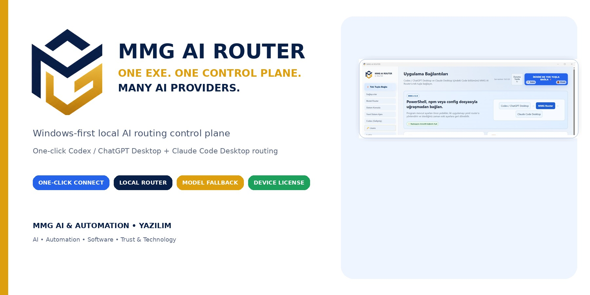

  <strong>TEK EXE. TEK KONTROL NOKTASI. ÇOKLU AI SAĞLAYICI.</strong> 
  <strong>MMG AI & AUTOMATION • YAZILIM</strong> tarafından geliştirilen Windows-first yerel AI yönlendirme kontrol kabuğu.

<a href="https://github.com/MMG-ex/MMG-AI-Router/releases/download/v1.0.9/MMG-AI-Router-v1.0.9.exe"><strong>⬇ MMG AI Router v1.0.9 İndir</strong></a> Windows x64 · <a href="https://github.com/MMG-ex/MMG-AI-Router/releases/download/v1.0.9/SHA256SUMS.txt">SHA-256 doğrulama</a> · <a href="https://github.com/MMG-ex/MMG-AI-Router/releases/tag/v1.0.9">Sürüm notları</a>

  <a href="../../releases"><strong>Releases / İndirmeler</strong></a>
  ·
  <a href="README.md">English</a>
  ·
  <a href="docs/VERIFY_DOWNLOAD.md">Dosyayı Doğrula</a>
  ·
  <a href="SECURITY.md">Güvenlik</a>

## MMG AI Router ne yapar?

MMG AI Router; Windows üzerinde uyumlu AI kodlama istemcilerini, sağlayıcıları ve yerel router katmanını tek bir masaüstü kabuğundan yönetmeyi amaçlar.

v1.0.9 arayüzünde öne çıkan alanlar:

- **Codex / ChatGPT Desktop ve Claude Code Desktop için tek tuş bağlantı akışı**
- **API sağlayıcı kataloğu ve adım adım anahtar kurulumu**
- **otomatik model sıralama ve fallback**
- **sınırlandırılmış / allowlist yerel sistem ajanı**
- **Codex tanılama ve bağlantı testleri**
- **4 günlük deneme + cihaz bazlı lisans akışı**
- **yerel loglar, gizlilik ayarları ve şifreli API aktarımı**

> MMG AI Router bağımsız bir üründür. Üçüncü taraf ürün ve servis adları ilgili sahiplerine aittir.

## Ürünün ana ekranı

  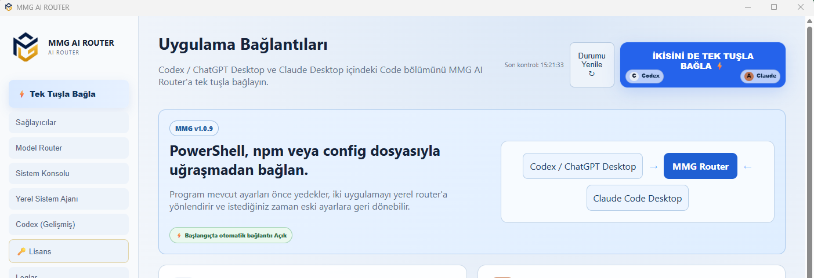

## Kısa demo

  <a href="../../releases/tag/v1.0.9">
    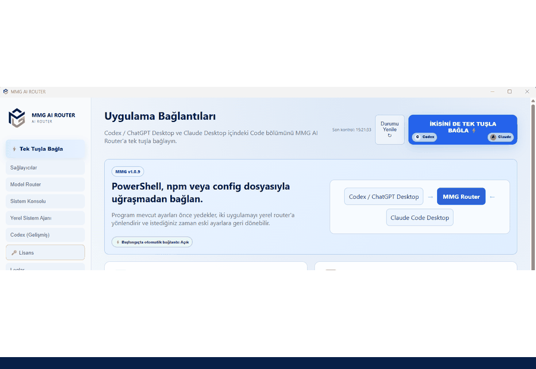
  </a>

Public görsellerde yerel Windows kullanıcı adı ve Device ID gibi kişisel/cihaza özgü ayrıntılar gösterilmez.

## Sağlayıcı yönetimi

  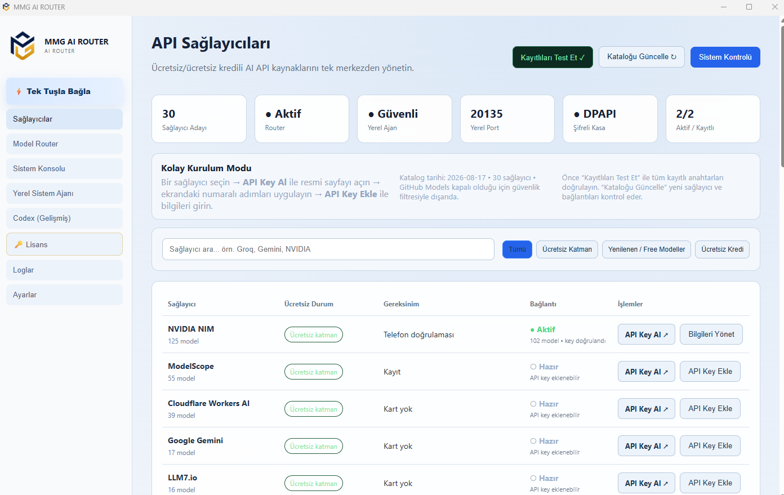

## Otomatik Model Router / Fallback

  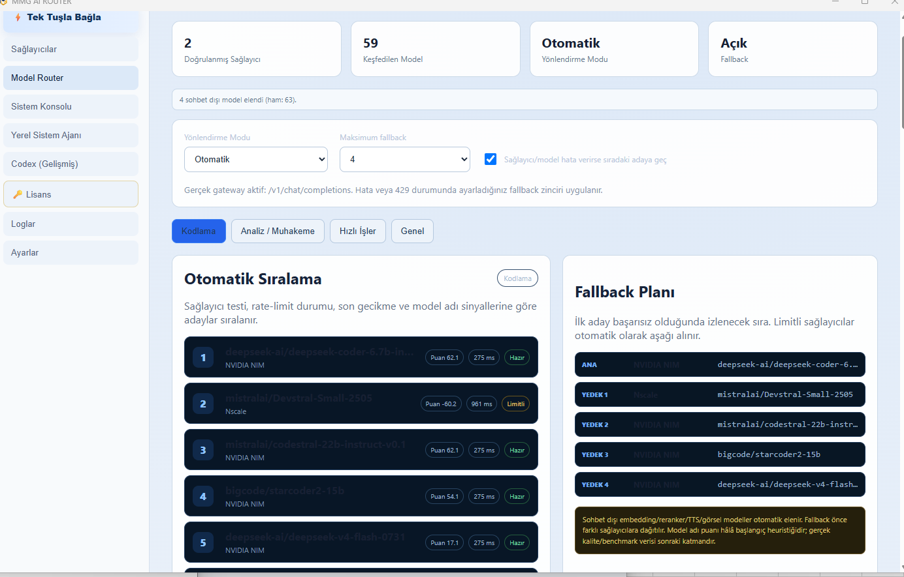

## Yerel Sistem Ajanı

  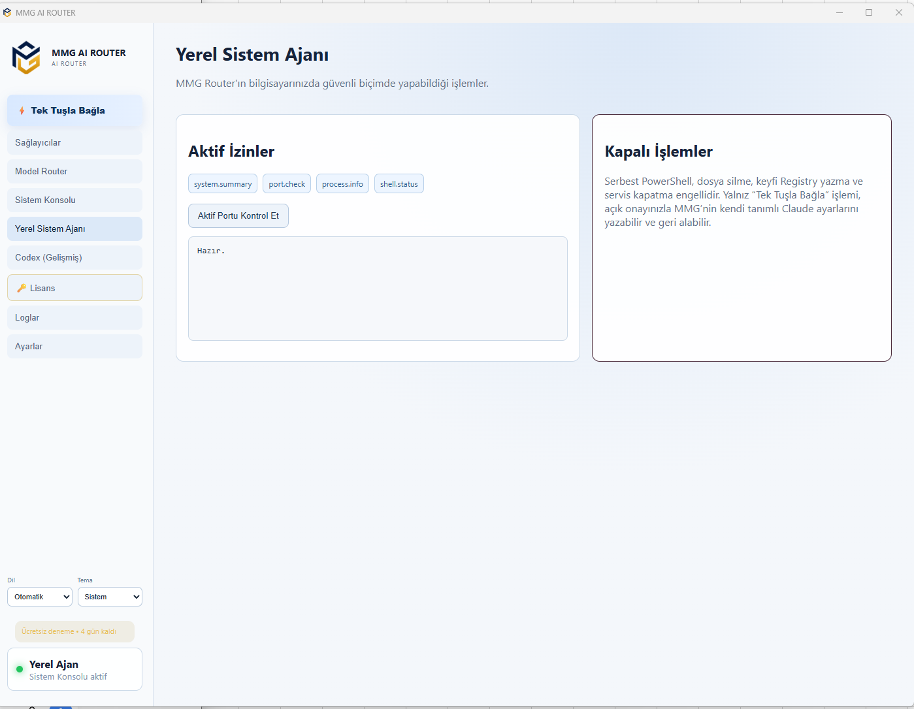

## Codex gelişmiş tanılama

  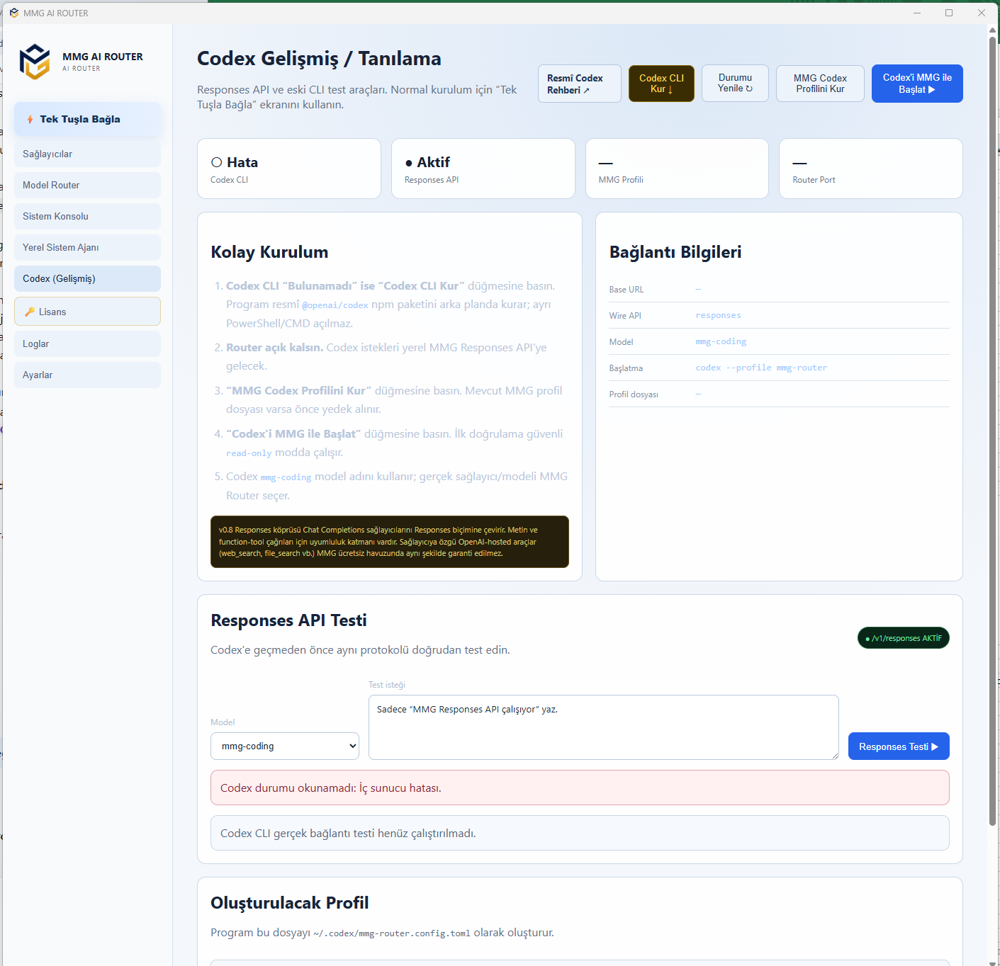

## Deneme ve lisans

  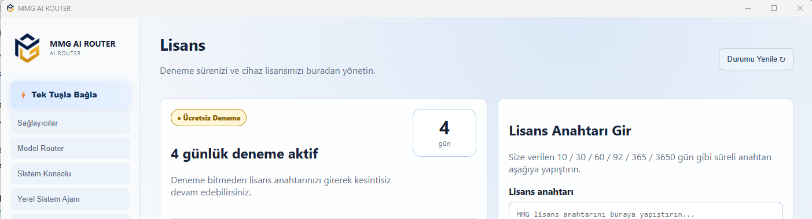

## Gizlilik ve ayarlar

  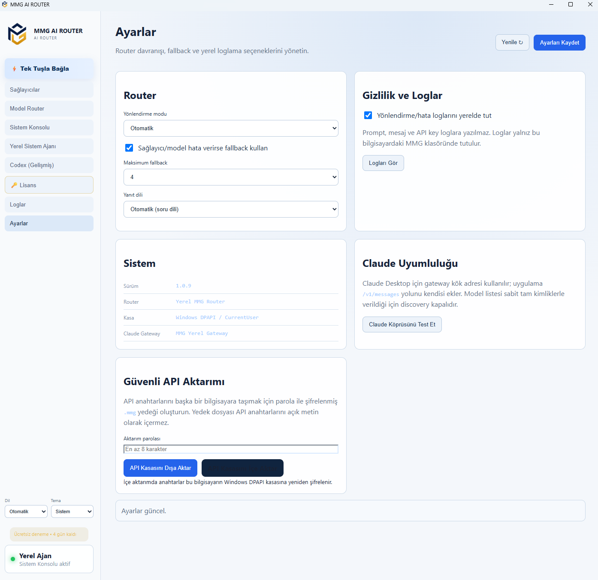

v1.0.9 arayüzü API anahtarı kasası için **Windows DPAPI / CurrentUser** ifadesini kullanıyor ve prompt/mesaj/API key içeriklerinin loglara yazılmadığını belirtiyor. Bu ifadeler ürünün mevcut arayüzünü açıklar; bağımsız bir güvenlik denetimi değildir.

## Mimari

  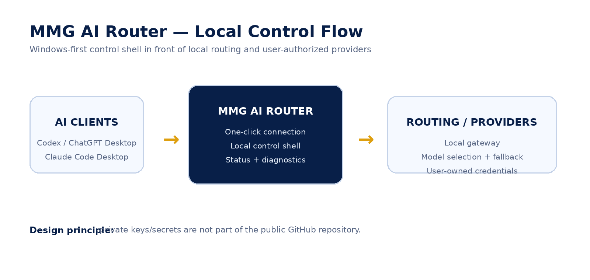

## Güvenlik ve yayın politikası

  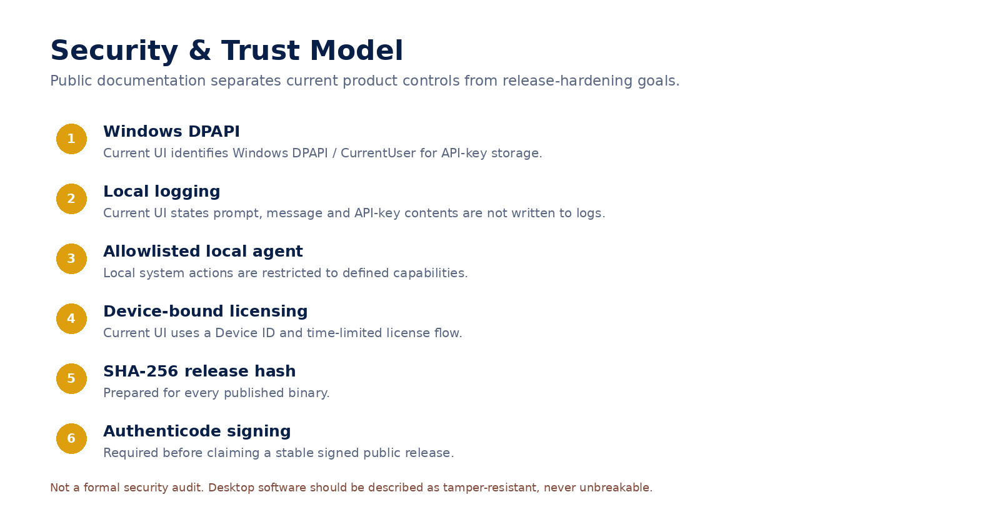

Public dağıtım prensibi:

1. EXE normal repo dosyası olarak değil **GitHub Releases** üzerinden dağıtılır.
2. Her binary için **SHA-256** yayımlanır.
3. API anahtarı, private key, `.env`, PFX/P12 ve production credential public repoya girmez.
4. Bir sürüme “signed / imzalı” denmeden önce gerçek **Authenticode + timestamp** uygulanır.
5. Proprietary kaynak kod ve private lisans altyapısı public dağıtım reposundan ayrı tutulur.

## Konumlandırma

Benzer alanlarda local LLM gateway, multi-provider router ve coding-client gateway projeleri bulunmaktadır. Bu nedenle MMG AI Router için “dünyada ilk AI router” iddiası kullanılmaz.

Farklılaştırıcı ürünleştirme kombinasyonu: **tek EXE kabuk + tek tuş istemci bağlantısı + yerel routing + sağlayıcı/model yönetimi + cihaz bazlı ticari lisans + doğrulanabilir binary dağıtımı**.

---
<h2>🔑 Lisans mı gerekiyor?</h2>

MMG AI Router <strong>4 günlük ücretsiz deneme</strong> içerir. 
30 / 60 / 90 / 365 günlük lisans seçenekleri sunulmaktadır.

<a href="mailto:mmgaiautomation@gmail.com?subject=MMG%20AI%20Router%20Lisans%20Talebi">
<strong>🔑 Lisans Talep Et</strong>
</a>

İletişim: <a href="mailto:mmgaiautomation@gmail.com">mmgaiautomation@gmail.com</a>

  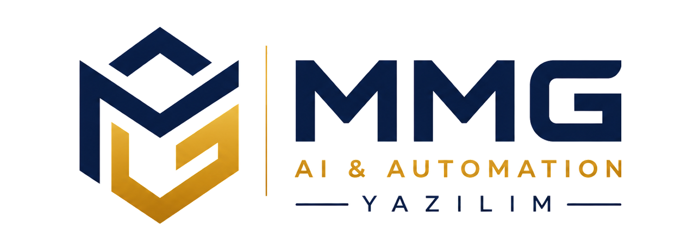

